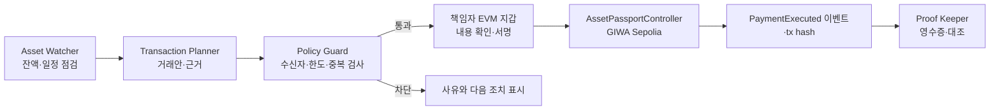

# Asset Passport 기술 원페이저

## 제품이 하는 일

Asset Passport는 온체인 자산을 관리하는 팀이 AI의 도움을 받아 거래안을 검토하고, 책임자의 지갑 승인이 있어야만 그 거래를 GIWA에서 실행하게 하는 자산 통제 도구다.

AI가 자금을 옮기지는 않는다. AI는 잔액 부족이나 예정 지급 같은 운영 신호를 찾아 거래안을 만들고 이유를 설명한다. 정해 둔 정책은 코드가 검사하고, 최종 실행은 사람의 지갑 서명으로만 가능하다.

첫 사용자는 Web3 프로젝트, DAO, RWA 운영팀처럼 이미 온체인 자금이나 토큰을 다루는 재무·운영 담당자다. Asset Passport는 전체 ERP나 수탁 서비스가 아니라, 자산 이동 전의 승인과 실행 후 증빙에 집중한다.

## 한 건의 거래가 처리되는 방식

예시: 지갑의 Test ETH 잔액이 기준보다 낮을 때

1. **Asset Watcher**가 잔액과 예정 지급을 점검한다.
2. **Transaction Planner**가 허용된 수신 계정에 `0.001 Test ETH`를 보충하는 거래안을 만든다.
3. **Policy Guard**가 수신자 화이트리스트, 건당 한도, 동일 제안의 재실행 여부를 결정적으로 검사한다.
4. 책임자가 수신자·금액·근거를 확인하고 자신의 EVM 지갑으로 서명한다.
5. **AssetPassportController**가 정책을 다시 확인한 뒤에만 GIWA에서 전송을 실행한다.
6. **Proof Keeper**가 tx hash와 실행 결과를 영수증으로 대조한다.

## AI·정책·사람·체인의 책임 경계

| 주체 | 맡는 일 | 맡지 않는 일 |
| --- | --- | --- |
| AI 에이전트 | 잔액·일정 신호 점검, 거래안과 근거 설명, 실행 결과 요약 | 개인키 보관, 승인, 자산 이동 |
| Policy Guard | 허용 수신자, 건당 한도, 중복 실행을 코드 규칙으로 검사 | LLM 판단으로 정책 변경 |
| 책임자 지갑 | 거래 내용 확인과 최종 서명 | AI에 서명 권한 위임 |
| GIWA | 승인된 자산 이동과 이벤트 기록 | 원본 회계자료·개인정보 보관 |
| Proof Keeper | tx hash·실행 상태 대조와 영수증 생성 | 자동 재시도·자동 송금 |

LLM은 선택적인 설명 계층이다. 정책 통과 여부는 LLM이 아니라 Policy Guard와 컨트랙트가 결정한다. 현재 MVP는 내장 규칙 엔진을 기본으로 하며, 로컬 Ollama 또는 HTTPS 보안 릴레이는 설명 기능을 위한 연결 방식으로만 다룬다. API 키와 개인키는 브라우저에 저장하지 않는다.

## 왜 GIWA를 쓰는가

이 제품은 일반 업무 워크플로를 체인에 올리는 서비스가 아니다. 통제 대상 자체가 온체인 자산 거래이므로, 사람의 지갑 서명·실제 자산 이동·실행 이벤트를 같은 체인에서 대조할 수 있다.

- 제안 내용과 정책 스냅샷의 해시를 실행 기록에 묶어 사후 대조한다.
- 팀 밖의 감사자나 파트너도 서비스 데이터베이스가 아니라 tx hash로 실행 결과를 확인한다.
- GIWA Test ETH는 테스트 거래와 수수료에 쓰는 네이티브 자산이며, MVP는 별도 토큰을 발행하지 않는다.

온체인 자산 이동이 없는 일반 ERP 업무에는 기존 ERP·결재 도구가 더 적합하다.

## 스마트 컨트랙트와 보안 통제

`AssetPassportController`는 다음을 강제한다.

- Controller owner만 정책을 등록하고 결제를 실행할 수 있다.
- 등록된 수신 계정에만 전송할 수 있다.
- 건당 한도를 넘는 전송은 거절한다.
- 같은 proposal hash는 다시 실행할 수 없다.
- 제안 해시와 정책 해시는 실행 이벤트에 남는다.

Foundry 기준 컴파일러는 Solidity `0.8.24`, optimizer는 활성화했으며 runs는 `200`이다. 단위 테스트는 owner 권한, 수신자 제한, 한도, 중복 실행 차단을 검증한다.

## 실제 테스트넷 증빙

- 네트워크: GIWA Sepolia, chain ID `91342`
- Controller: [0x4fbD…3dc5f](https://sepolia-explorer.giwa.io/address/0x4fbD9a0458930A76d6ceCf3B572A093dD9E3dc5f)
- 정책 등록: [PayeePolicyUpdated](https://sepolia-explorer.giwa.io/tx/0x46048e6a33866197c7c77e1dbd63cb5cd62336ce4a4dea4d67b5b1a0312ff512)
- Test ETH 예치: [Funded](https://sepolia-explorer.giwa.io/tx/0xa6beebbb2362efa80cbf44622cfd93bb3aa14eeb6c4e5a306b65d12cfb1ebfc7)
- `0.001 Test ETH` 실행: [PaymentExecuted](https://sepolia-explorer.giwa.io/tx/0xfc67718e69ac3bdcba54b18057f39eb9b1c51099195b91328a8eccd47b989871)

테스트 전용 CLI 지갑으로 정책 등록, 자금 예치, 실행을 완료했다. 같은 proposal hash의 재실행은 `ProposalAlreadyExecuted`로 차단했다. 컨트랙트 바이트코드는 배포되어 있으나, Explorer의 소스 코드 검증은 아직 완료되지 않았다. 공개 MVP에서 브라우저 지갑으로 같은 흐름을 수동 확인하는 작업도 남아 있다.

## MVP 범위와 다음 단계

현재 MVP는 AI 제안, 결정적 정책 검사, 사람 승인, GIWA Test ETH 실행, 실행 영수증의 연결을 증명한다. 개인키 보관, AI 자동 실행, 무인 자금 운용, 법정화폐 회계·세금·인보이스, 실제 자금 수탁은 범위에 넣지 않는다.

다음 단계는 서버 스케줄러로 Watcher를 주기 실행하고, 거래안과 정책 스냅샷을 보관하며, 공개 MVP에서 owner 브라우저 지갑으로 실행·영수증 확인을 마치는 것이다.

## 공개 링크

- [MVP 데모](https://redsunjin.github.io/assetpass/mvp/)
- [기술 구현 저장소](https://github.com/redsunjin/assetpass)
- [테스트넷 E2E 상세 기록](testnet-e2e-evidence.md)
